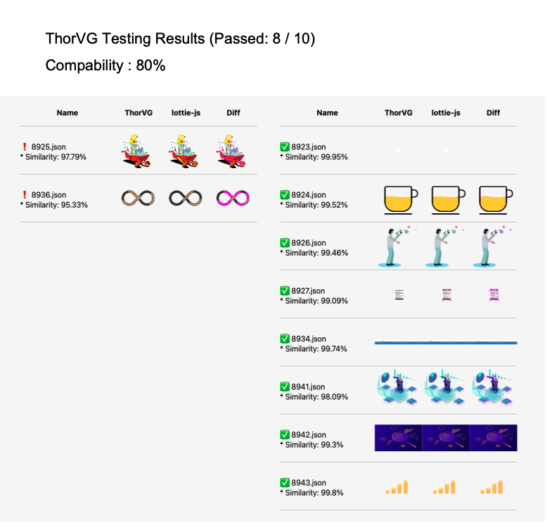

# ThorVG Test Automation

ThorVG Test Automation is a comprehensive rendering test tool designed for the ThorVG Engine. This versatile tool operates seamlessly as both a Graphical User Interface (GUI) and a Command-Line Interface (CLI). Its primary function is to identify rendering errors by performing a meticulous canvas bitmap comparison automatically.

## Key Features

### Dual Interface Capability
The tool is equipped with both a Graphical User Interface (GUI) and a Command-Line Interface (CLI), providing flexibility for different testing environments and user preferences.

### Automated Rendering Error Detection
ThorVG Test Automation streamlines the testing process by automatically detecting rendering errors. Through a sophisticated canvas bitmap comparison, it quickly identifies discrepancies, ensuring the reliability and accuracy of rendered images.

## How It Works

### GUI
In GUI mode, developers benefit from a user-friendly interface, allowing them to interact with the tool effortlessly. The graphical representation aids in visualizing rendering errors, making the debugging process more intuitive.
- [Try it out](https://thorvg-test-automation.vercel.app)

### CLI
For a streamlined and automated testing workflow, the Command-Line Interface is ideal. It facilitates integration into automated testing pipelines and continuous integration systems.

```sh
$npm i -g ./cli # in thorvg.test-automation

$tvg-cli /path/to/target-dir

$open result.pdf # open the summarized PDF
```

```
Options:
    -E  Run automatic classification after test
    -D  Debug Mode, test with GUI, CLI at same time
    -V  Verbose, log all

    Target:
        The directory path where `.json` files are located,
        at least one of valid lottie json has to be provided.
```

## Review with PDF

Upon completion of the test, the system ensures a seamless experience for result retrieval. You will receive a PDF document containing the detailed test results, allowing for easy inspection and review.

- **GUI**: The GUI mode simplifies the process further by automatically opening the PDF in a new tab. This user-friendly feature ensures immediate visibility of the test outcomes, enhancing the efficiency of result assessment.

- **CLI**: In CLI mode, the system generates a file named result.pdf in your current working directory. This approach provides a straightforward and organized means of accessing and storing the test results for further analysis or archival purposes.

<p align="center">
    
</p>
